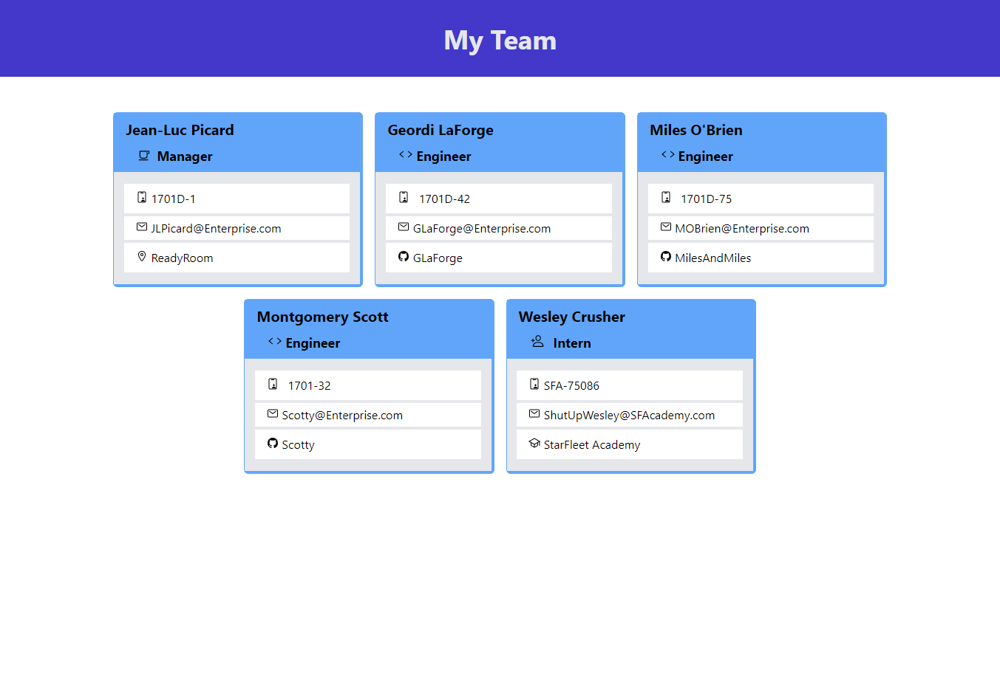

# Team Builder

## Table of Contents

I. [Description](#description)  
II. [Install Instructions](#install-instructions)  
III. [Usage Information](#usage-information)  
IV. [Contribution Guidelines](#contribution-guidelines)  
V. [Testing Instructions](#testing-instructions)  
VI. [Questions / Contact](#contact)  
VII. [License](#license)

## <a id="description">I. Description</a>

Prompts the user for basic information for each member of their team (Manager, Engineer, Intern) and generates an easy to reference html page that can be viewed in the browser.

## <a id="install-instructions">II. Install Instructions</a>

Fork this repository and clone it to your local machine. You will need Inquirer for the prompts and Jest for testing.

## <a id="usage-information">III. Usage Information</a>

Navigate to assets/js and run 'node index.js', answer the prompts in the terminal and select 'Finished' when you are done.  
'team.html' will generate in the assets folder, open it in your browser to see the team.

### Project Screenshot

### Credits

This NodeJS project uses <a href="https://www.npmjs.com/package/inquirer" target="_blank">Inquirer</a> to run in the terminal, and <a href="https://www.npmjs.com/package/inquirer" target="_blank">Jest</a> for testing.

## <a id="contribution-guidelines">IV. Contribution Guidelines</a>

Contact me to contribute, let's collaborate.

## <a id="testing-instructions">V. Testing Instructions</a>

There are tests for each of the 4 classes, to validate that the constructor functions work properly.  
Navigate into 'assets/js' and run 'npm test' to run the tests.

## <a id="contact">VI. Questions / Contact</a>

If you have any questions, or want to contribute to this or any other project feel free to contact me.

### email

ChampionMike42@gmail.com

### GitHub

<a href="https://github.com/MikeChampion" target="_blank">MikeChampion @ Github</a>

## <a id="license">VII. License</a>

Copyright 2021 Mike Champion
 
        
Permission is hereby granted, free of charge, to any person obtaining a copy of this software and associated documentation files (the "Software"), to deal in the Software without restriction, including without limitation the rights to use, copy, modify, merge, publish, distribute, sublicense, and/or sell copies of the Software, and to permit persons to whom the Software is furnished to do so, subject to the following conditions:

        
The above copyright notice and this permission notice shall be included in all copies or substantial portions of the Software.

        
THE SOFTWARE IS PROVIDED "AS IS", WITHOUT WARRANTY OF ANY KIND, EXPRESS OR IMPLIED, INCLUDING BUT NOT LIMITED TO THE WARRANTIES OF MERCHANTABILITY, FITNESS FOR A PARTICULAR PURPOSE AND NONINFRINGEMENT. IN NO EVENT SHALL THE AUTHORS OR COPYRIGHT HOLDERS BE LIABLE FOR ANY CLAIM, DAMAGES OR OTHER LIABILITY, WHETHER IN AN ACTION OF CONTRACT, TORT OR OTHERWISE, ARISING FROM, OUT OF OR IN CONNECTION WITH THE SOFTWARE OR THE USE OR OTHER DEALINGS IN THE SOFTWARE.

